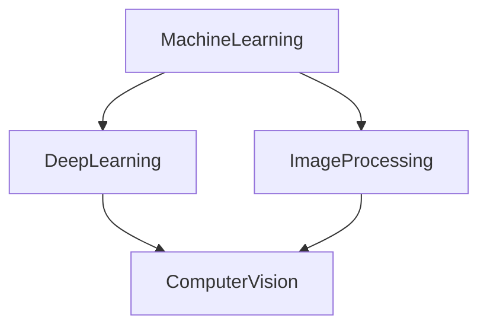

<h1 align="center">Hi , I'm Ahmed Hamdy</h1>
<h3 align="center">I'm an  Ai engineer,Web developer.</h3>

## 🙋‍♂️ About Me

- 🔭 I am a highly motivated Ai Engineer and Web Developer who has a track record of success creating apps that are both well-received and 
commercially viable. Skilled with working as a team and incorporating input into projects. Ability to always look for ways to improve upon an already existing apps to keep people enjoying it. Strong eye for detail and tenacity to never quit on something until it is absolutely 
perfect.

- 🌱 I’m currently learning :

- 👯 I’m looking to collaborate on **Machine learning and Web Developments Projects**

- 👨‍💻 All of my projects are available at **[My Portfolio]([https://github.com/NourEldinMoustafa](https://github.com/ahmedovich19))**

- 📫 How to reach me **[My personal Email](mailto:ahmed_hamdy19593@yahoo.com)**

- ⚡ Fun fact **chess player.**

-  

## 🚀 Languages and Tools:

     
     
        
     
     
    
     
     
       
     
     
     
    
    
    
     
     
    
    
     
     
     
     
    
    
    
    
    
    
    

    
    
    
    
    

<!--       -->
 

    

## 📊 My Github Stats

   
    
  
   
  <b>Note:</b> Top languages is only a metric of the languages my public code consists of and doesn't reflect experience or skill level.

 
 

 
 

## Connect with me:

## ❤ Views and Followers

